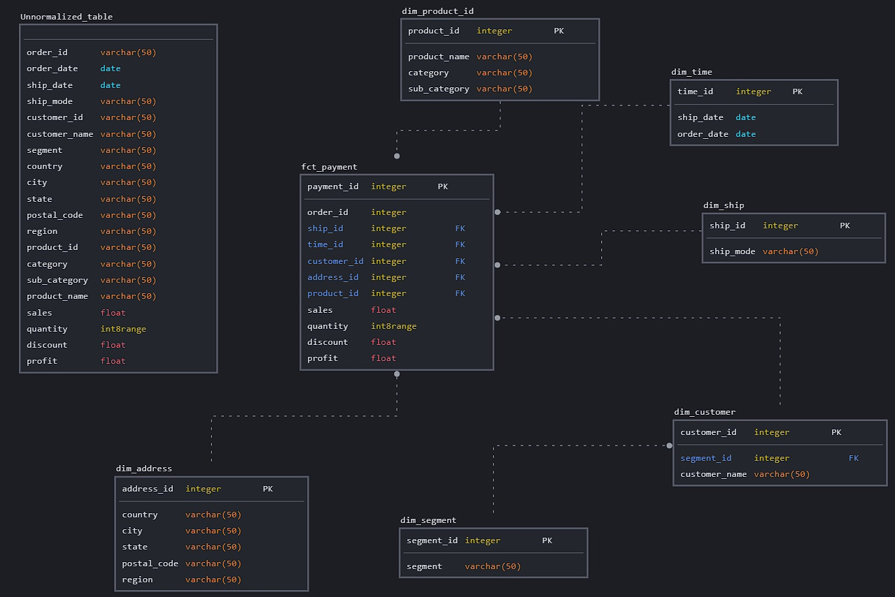
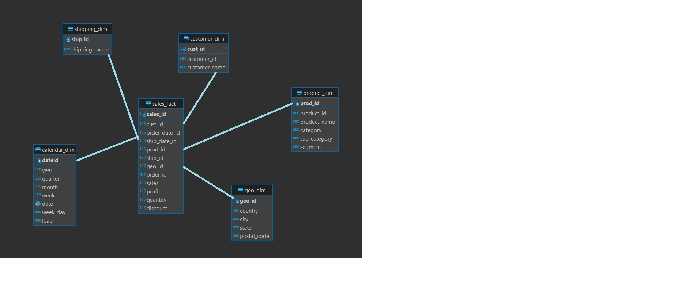

# Домашние задания модуля 2
<<<<<<< HEAD
=======
<<<<<<< HEAD
>>>>>>> dcce019fcc13c20be09b1805524d19af6da19ced
2.4: Модели Данных
Вам необходимо нарисовать модель данных для нашего файлика Superstore:
Концептуальную
Логическую
Физическую Вы можете использовать бесплатную версию SqlDBM или любой другой софт для создания моделей данных баз данных.
Когда вы нарисуете модель данных, вам нужно скопировать DDL и выполнить его в SQL клиенте.
Вам необходимо сделать INSERT INTO SQL, чтобы заполнить Dimensions таблицы и Sales Fact таблицу. Сначала мы заполняем Dimensions таблицы, где в качестве id мы генерим последовательность чисел, а зачем Sales Fact таблицу, в которую вставляем id из Dimensions таблиц.

Мое решение

Решение автора

2.5: База данных в облаке

Для создания БД в облаке воспользовался сервисом elephantsql
Загрузите данные (Superstore dataset) в staging (схема БД stg) и загрузите dimensional model (схема dw). Вы можете использовать пример SQL для этого упражнения:
Staging stg.orders.sql
Business Layer from_stg_to_dw.sql

2.6: Как донести данные до бизнес-пользователя. Построение дашборда на основе облачного БД(Пример решений на Google Sheets)

<<<<<<< HEAD
НАПИСАТЬ ЦЕЛИ ДАШБОРДА
=======
НАПИСАТЬ ЦЕЛИ ДАШБОРДА
=======
>>>>>>> 4799dfaf0551eaa9f312c66910a079f3ba516d06
>>>>>>> dcce019fcc13c20be09b1805524d19af6da19ced
