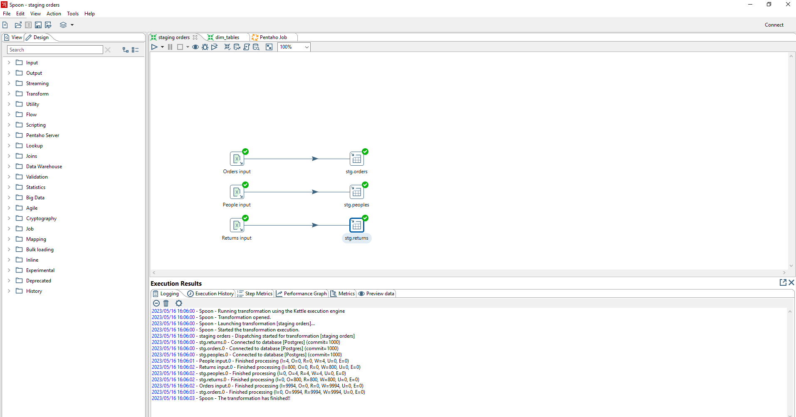
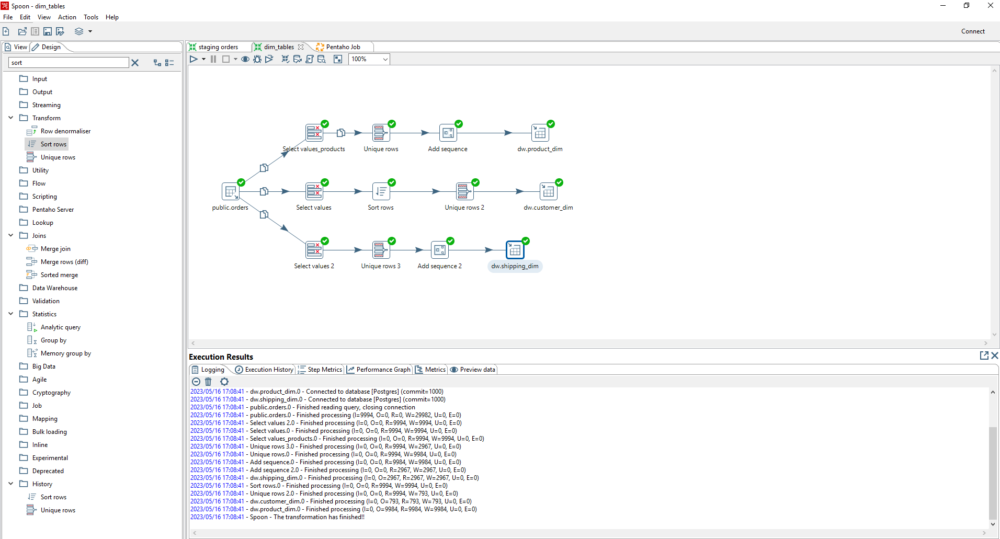
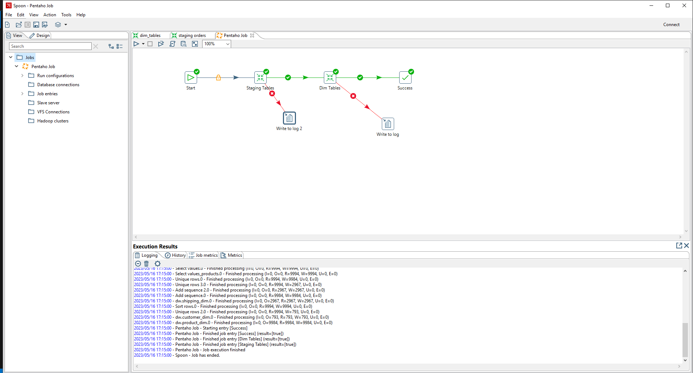

# Домашние задания модуля 4
## В этой папке находятся jobs для Pentaho DI, которые необходимы для домашнего задания модуля 4:
1. <b>staging orders.ktr</b> - трансформация, которая загружает данные из файлы Superstore в Postgres

Суть процесса: с одного файла superstore.xls в каждую новую созданную таблицу выгружаем датасет с каждого листа.

1. <b>dim_tables.ktr</b> - трансформация, которая трансформирует данные (T в ETL) внутри нашей базы данных

Суть процесса: теперь главную таблицу orders делим на измерения-таблицы. product_dim будет хранить метрики для продуктов, но при их загрузки проверяем их на уникальность и добавляем суррогатный ключ.

1. <b>Pentaho Job.kjb</b> - главный job, который выполняет последовательность трансформаций (оркестрирует нашим data pipeline)

Суть процесса: объединяем все наши транформации в единый цикл, не забывая добавить обработку исключения 